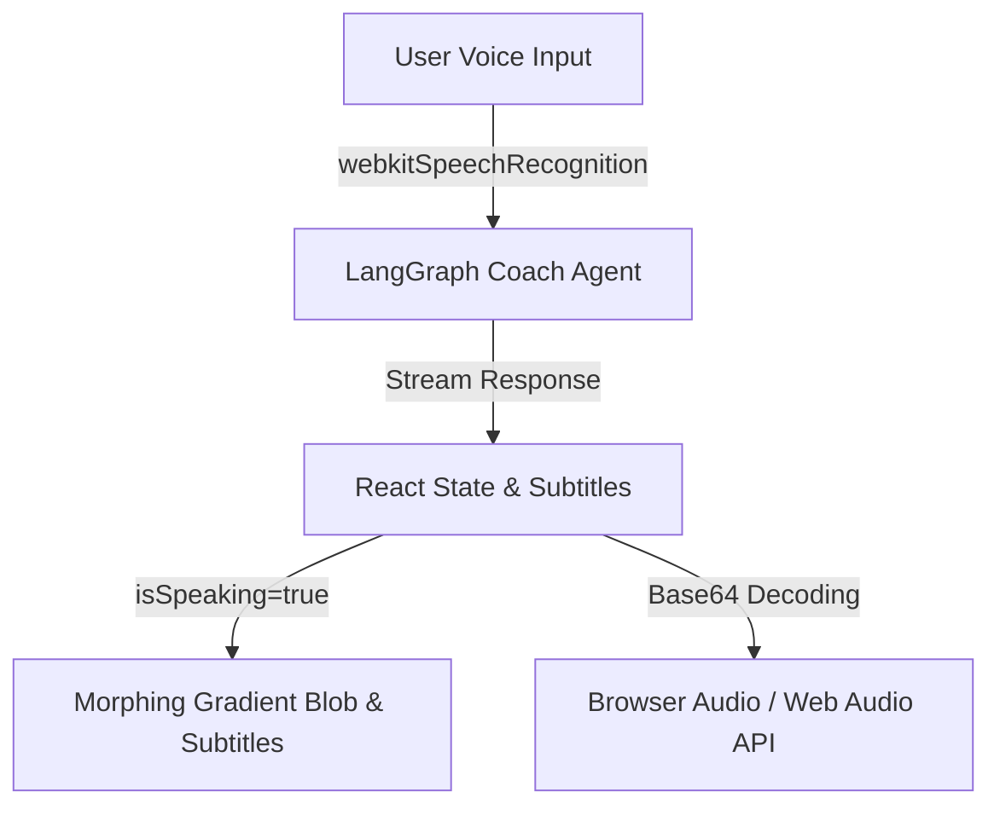

# AI Coach Centered Fluid Blob (Hayat) Implementation Guide

This document outlines the frontend implementation plan for the **MindHack AI Coach** page (`/coach`), focusing on a centered, morphing fluid gradient blob design inspired by Hayat.

---

## 1. Core Architecture

The virtual coach session simulates an interactive voice check-in call set against a pitch-black backdrop. The visual center is a fluid, morphing gradient blob that dynamically alters its deformation speed and scale based on active vocalization.



---

## 2. Morphing Animation CSS (`index.css`)

The organic, irregular morphing effect is achieved purely through CSS-driven `border-radius` transitions at different keyframe intervals:

```css
@keyframes morph {
  0% { border-radius: 42% 58% 70% 30% / 45% 45% 55% 55%; }
  25% { border-radius: 70% 30% 52% 48% / 60% 40% 60% 40%; }
  50% { border-radius: 50% 50% 28% 72% / 35% 65% 35% 65%; }
  75% { border-radius: 35% 65% 60% 40% / 50% 50% 50% 50%; }
  100% { border-radius: 42% 58% 70% 30% / 45% 45% 55% 55%; }
}

.animate-morph {
  animation: morph 12s ease-in-out infinite;
}

.animate-morph-speaking {
  animation: morph 6s ease-in-out infinite;
}
```

---

## 3. Page Layout & Control Panel (`Coach.js`)

The page layout centers the morphing blob with Hayat's name and transparent badge badge details:

```jsx
import { useState, useEffect } from 'react';
import { useNavigate } from 'react-router-dom';
import { ArrowLeft, Mic, MicOff, ListTodo, PhoneOff, Send, Keyboard, ChevronDown } from 'lucide-react';

export default function Coach() {
  const navigate = useNavigate();
  const [isMuted, setIsMuted] = useState(false);
  const [isSpeaking, setIsSpeaking] = useState(false);
  const [currentSubtitles, setCurrentSubtitles] = useState('');
  const [showTextInput, setShowTextInput] = useState(false);

  return (
    <div className="relative h-screen w-full bg-black flex flex-col justify-between p-6 max-w-[430px] mx-auto overflow-hidden">
      
      {/* 1. Header Bar */}
      <div className="flex justify-between items-center w-full">
        <button onClick={() => navigate(-1)} className="flex items-center gap-1.5 text-white/50 bg-white/5 px-3 py-1.5 rounded-xl">
          <ArrowLeft className="w-3.5 h-3.5" /> Previous
        </button>
      </div>

      {/* 2. Centered Fluid Blob Container */}
      <div className="flex-1 flex flex-col items-center justify-center relative w-full">
        <div className={`absolute w-[280px] h-[280px] rounded-full bg-indigo-500/20 blur-[80px] transition-all duration-1000 ${
          isSpeaking ? 'scale-125 opacity-100' : 'scale-100 opacity-60'
        }`} />

        <div className={`w-[290px] h-[290px] bg-gradient-to-tr from-blue-600 via-indigo-500 to-fuchsia-500 shadow-[0_0_60px_rgba(99,102,241,0.4)] flex flex-col items-center justify-center p-8 text-center transition-all duration-700 transform ${
          isSpeaking ? 'scale-105 animate-morph-speaking' : 'scale-100 animate-morph'
        }`}>
          {currentSubtitles ? (
            <p className="text-sm font-bold leading-relaxed tracking-tight text-white/95 max-w-[210px] animate-fade-in">
              {currentSubtitles}
            </p>
          ) : (
            <div className="flex flex-col items-center">
              <h2 className="text-2xl font-medium text-white/90">
                Hi, I'm <span className="font-extrabold text-white">Hayat</span>
              </h2>
              <div className="mt-3 flex items-center gap-1 bg-white/10 border border-white/20 px-2.5 py-1 rounded-full">
                <span className="text-[9px] font-bold text-white/80">an AI Assistant</span>
                <ChevronDown className="w-3 h-3 text-white/60" />
              </div>
            </div>
          )}
        </div>
      </div>

      {/* 3. Control Panel */}
      <div className="grid grid-cols-3 gap-4 bg-white/5 border border-white/10 p-4 rounded-3xl">
        <button onClick={toggleMute} className="w-full py-3.5 bg-white/5 rounded-2xl">
          {isMuted ? <X className="w-5 h-5" /> : <Mic className="w-5 h-5" />}
        </button>
        <button onClick={toggleHold} className="w-full py-3.5 bg-white/5 rounded-2xl">
          {isHeld ? <Play className="w-5 h-5" /> : <Pause className="w-5 h-5" />}
        </button>
        <button onClick={() => setShowTextInput(!showTextInput)} className="w-full py-3.5 bg-white/5 rounded-2xl">
          <Keyboard className="w-5 h-5" />
        </button>
      </div>

    </div>
  );
}
```

---

## 4. Google AI Studio (Gemini API) Text-to-Speech Integration

To output high-fidelity coach dialogue, the backend fetches speech audio dynamically from Gemini.

### Response Payload Structure
```json
{
  "text": "Hello Sami, let's look at your progress today.",
  "audio": "UklGRu...[Base64 encoded speech bytes]"
}
```

### Audio Context Decoding Flow
On receiving response, the base64 string is parsed to an `AudioBuffer` and played via the browser's Web Audio API context. `isSpeaking` state is set during playback:

```javascript
async function playAudioBytes(audioBase64, text) {
  const binary = window.atob(audioBase64);
  const bytes = new Uint8Array(binary.length);
  for (let i = 0; i < binary.length; i++) {
    bytes[i] = binary.charCodeAt(i);
  }
  
  const ctx = new (window.AudioContext || window.webkitAudioContext)();
  const buffer = await ctx.decodeAudioData(bytes.buffer);
  
  const source = ctx.createBufferSource();
  source.buffer = buffer;
  source.connect(ctx.destination);
  
  setCurrentSubtitles(text);
  setIsSpeaking(true);
  
  source.onended = () => {
    setIsSpeaking(false);
  };
  
  source.start(0);
}
```
