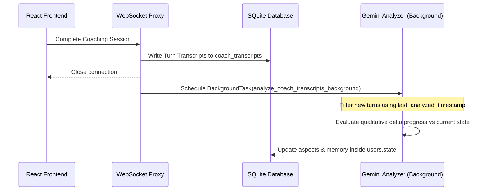

# AI Wheel of Life Scoring & Analysis Specification

This document details the architecture, input/output structures, and evaluation logic for updating a user's Wheel of Life aspect ratings and behavioral memory profiles dynamically from live coaching sessions.

---

## 1. Core Logic & Cognitive Analysis
The evaluation must rely on **behavioral and situational evidence** rather than simple keyphrase matching or superficial sentiment indicators.

### Evaluation Guidelines for the LLM
1. **Delta-Based Assessment**: Do not output absolute scores. The model must output a directional shift (`delta`) from the current score. The permitted deltas are:
   * `+2` (significant progress with strong evidence)
   * `+1` (mild progress or positive shift)
   * `0` (no change, topic not discussed, or insufficient evidence)
   * `-1` (mild regression or negative shift)
   * `-2` (significant regression with strong evidence)
2. **Evidence-Based Rating**: Only apply non-zero deltas when the user shares concrete behavior, actions, or physical boundaries. Do not rate based on stated intentions or generalized optimism (e.g. *"I plan to start studying next week"* $\rightarrow$ `delta: 0`).
3. **Anti-Repetition Check**: The prompt receives the user's existing `memory.user_patterns`. If the user describes a situation or pattern that is already captured without showing new developments, progress, or deterioration, the model must output `delta: 0` for that aspect.
4. **Distinguishing Mood vs. Progress**: Separate transient, session-specific emotional states (e.g., excitement, temporary frustration) from actual overall stability and progress in a life category.

---

## 2. Input / Output Contracts

### Input Payload
The analysis worker passes the user's current state database object alongside the turn-by-turn text transcripts of the latest unanalyzed coaching session.

```json
{
  "current_state": {
    "aspects": [
      { "name": "Health & Fitness", "score": 7, "vision": "No pain, sleeping 8 hours" },
      { "name": "Finance & Wealth", "score": 4, "vision": "Eliminate credit card debt" }
    ],
    "memory": {
      "user_patterns": ["Sacrifices sleep and health to meet work demands"],
      "emotional_triggers": ["Late night work stress"],
      "goals": ["Establish a hard cutoff time for work at 8 PM"]
    }
  },
  "transcript_delta": [
    { "speaker": "Riley", "text": "How did your week go regarding your bedtime routine?", "timestamp": "2026-05-23T05:10:00Z" },
    { "speaker": "User", "text": "Honestly, I stayed up late working every single night. I feel exhausted and my head has been hurting.", "timestamp": "2026-05-23T05:11:00Z" }
  ]
}
```

### Expected Output Payload
The response from the model must return a JSON object with aspect updates (specifying name, delta, reasoning, and a short focus/recommendation sentence) and newly extracted/refined memory insights and coach advice.

```json
{
  "aspect_updates": [
    {
      "name": "Health & Fitness",
      "delta": -1,
      "reasoning": "The user reported sleeping poorly every night and experiencing physical symptoms (headaches) because of work. This represents a mild decline in health & fitness due to active regression of sleep habits.",
      "focus": "Establish a firm 9:30 PM screen cutoff time to prioritize sleep hygiene and physical recovery."
    },
    {
      "name": "Finance & Wealth",
      "delta": 0,
      "reasoning": "The user did not mention any financial behaviors or changes in their financial situation during this session segment.",
      "focus": "Maintain active savings plan. Next: review monthly subscriptions to optimize recurring costs."
    }
  ],
  "memory": {
    "user_patterns": ["Prioritizes late night work over physical well-being"],
    "emotional_triggers": ["Exhaustion from night shifts"],
    "goals": ["Establish bedtime routine of winding down by 9:30 PM"]
  },
  "coach_advice": [
    "Commit to logging off work by 8 PM to protect sleep cycles.",
    "Introduce a relaxing 15-minute wind-down routine before sleep."
  ]
}
```

---

## 3. System Architecture & Flow



### Backend Resolution Logic
When applying LLM updates, the backend processes aspect changes with boundary clipping:
```python
for update in result.get("aspect_updates", []):
    name = update.get("name")
    delta = update.get("delta", 0)
    # Find matching aspect in user's state
    aspect = find_aspect(state["aspects"], name)
    if aspect and delta != 0:
        # Clip score between 1 and 10
        aspect["score"] = max(1, min(10, aspect["score"] + delta))
```
1. **Aspect Name Alignment**: The analyzer prompt dynamically pulls the exact aspect names configured in the user profile to prevent mapping failures during SQLite writes.
2. **Transaction Isolation**: Updates are merged atomically into SQLite's `state` field to avoid overwriting fields edited via onboarding.
