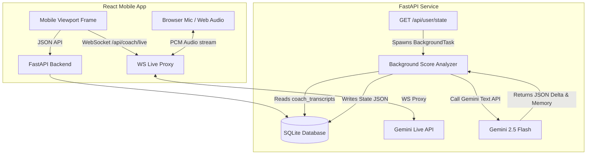

# MindHack: The Wheel of Life Coaching Platform

MindHack is a self-assessment, reflective journaling, and live AI coaching platform built around the "Wheel of Life" framework. It helps users balance life satisfaction across multiple key dimensions through structured daily journals and real-time bidirectional voice coaching.

---

## System Architecture



### Services & Port Mappings
* **Frontend**: React (Vite) development server running on port `3000`.
* **Backend**: FastAPI REST API & WebSocket server running on port `8000`.
* **Database Administrator**: SQLite-web browser interface running on port `8080`.

---

## Core Features

### 1. Onboarding Flow
* **Aspect Selection**: Users select 3 to 10 life categories (e.g., Health & Fitness, Finance & Wealth, Career & Work, Relationships, Fun & Recreation, Personal Growth, etc.).
* **Vision Setting**: Users rate their current satisfaction level (1-10) and define an ultimate target vision statement for each selected aspect.
* **Initial Wheel Generation**: The platform generates a spider-web/radial visualization displaying the user's starting balance configuration.
* **Authentication Gate**: User accounts are created after the initial wheel preview to persist progress to the database.

### 2. Guided Journaling
* **Borderless Notebook Editor**: A full-screen distraction-free writing environment that auto-hides headers and global navigation bars.
* **Personalized Prompt Cards**: Opens with a custom reflection prompt drawn from a cached pool of questions in `state.memory.guided_prompts`. Prompts target the user's lowest-scored aspects, active goals, or previous coach discussion topics.
* **Contextual Reflection Tool**: A floating help icon provides real-time suggestion prompts. If the input is empty or short (<15 chars), it pulls a cached helper. If active (>=15 chars), it triggers Gemini on typing pauses to generate custom elaboration nudges.
* **Inline Emotional Scanner**: Checks typed content in real-time against a predefined list of ~80 emotional keywords. Matching terms trigger a "Tag It" floating pill, opening the `EmotionSelectorSheet` modal on step 2 (emotion selection) with a mood-reactive background gradient.
* **Post-Save Reflection Summary**: Renders detected emotions, mapped categories, and a single-sentence AI micro-insight. Offers a call-to-action to immediately start a coaching conversation regarding the journal context.

### 3. Live AI Voice Coach (Riley)
* **Bidirectional Audio Proxy**: Streams 16kHz PCM mono audio from the browser microphone to the Gemini Live API via a FastAPI WebSocket relay proxy, and plays back 24kHz audio from Gemini.
* **Centered Morphing Blob UI**: An organic fluid SVG blob styling dynamic animations (wavy concentric circles, breathing, color glows) to indicate listening/speaking/held status.
* **Word-by-Word Subtitle Sync**: Rather than clipping text inside the morphing circle, transcripts display below the blob. Streamed WebSocket tokens are held in a queue and printed word-by-word at a constant 320ms interval to align with natural audio speech cadence.
* **Call Controls**: Minimalist controls to toggle Mute (microphone state), Hold (pauses audio playback and morph loops), and Keyboard input (text chat fallback).

### 4. Background Score & Memory Analyzer
* **Passive Evaluation**: Spawns a background worker on `GET /api/user/state` calls.
* **Delta-Based Scoring**: Evaluates newly recorded transcripts in `coach_transcripts` compared to `last_analyzed_timestamp` using `gemini-2.5-flash`. The model outputs directional updates: `+2`, `+1`, `0`, `-1`, or `-2` based on concrete behavior and action changes mentioned by the user.
* **Clipping Guard**: The backend processes deltas and clips values strictly between `1` (minimum) and `10` (maximum) to prevent out-of-bounds ratings.
* **Behavioral Memory Profile**: Extracts patterns, emotional triggers, goals, and coach advice, storing them nested inside the user's JSON state.

---

## Tech Stack

### Frontend
* **Core**: React 19 (JavaScript), Vite 6.
* **Styling**: Tailwind CSS 3 with custom transition curves for mood states.
* **Routing**: React Router v7 (`react-router-dom`).
* **Design Pattern**: Constrained Mobile-Only Viewport. Viewport is restricted to `max-w-[430px] w-full min-h-screen mx-auto` styled against a centering dark desktop background (`bg-slate-900`). All emojis are stripped and replaced with Lucide React SVG components.

### Backend
* **Core**: Python 3.11+, FastAPI.
* **LLM SDK**: `google-genai` (utilizing `gemini-2.5-flash` and Gemini Live voice protocols).
* **Authentication**: PyJWT (JSON Web Tokens) with Bcrypt password hashing.
* **Proxy Routing**: Python `websockets` package to handle raw PCM frame relays.

### Database
* **Engine**: SQLite.
* **JSON-Centric Storage Model**: Stores user configuration, journals, tasks, and coach history as serialized JSON columns inside a single `users` table to avoid migration overhead.

---

## Database Schema

```sql
CREATE TABLE users (
    id TEXT PRIMARY KEY,                   -- Username / Email
    password_hash TEXT NOT NULL,           -- Bcrypt-hashed password string
    state TEXT DEFAULT '{}',               -- User state JSON
    journals TEXT DEFAULT '[]',            -- Journal entries JSON Array
    tasks TEXT DEFAULT '[]',               -- Task list JSON Array
    coach_history TEXT DEFAULT '[]',       -- Legacy text-chat history JSON Array
    coach_transcripts TEXT DEFAULT '[]'    -- Real-time audio session transcripts JSON Array
);
```

### JSON Data Structures

#### User State (`state`)
```json
{
  "vision": "I want to achieve professional stability while retaining personal time for health.",
  "completedOnboarding": true,
  "aspects": [
    {
      "name": "Health & Fitness",
      "score": 6,
      "vision": "Sleep 8 hours regularly and walk daily."
    }
  ],
  "memory": {
    "user_patterns": [
      "sacrifices evening relaxation to finish work tasks"
    ],
    "emotional_triggers": [
      "late afternoon email notifications"
    ],
    "goals": [
      "log off work slack by 7:30 PM"
    ],
    "guided_prompts": [
      "What is one work boundary you held today?"
    ],
    "journal_suggestions": [],
    "last_analyzed_timestamp": "2026-05-23T05:00:00Z"
  },
  "mood": {
    "pleasantness": 4,
    "tags": ["focused", "calm"],
    "timestamp": "2026-05-23T08:00:00Z"
  }
}
```

#### Journal Entry Structure (`journals`)
```json
[
  {
    "id": "e4f87a8b-c9d0-4e2f-b3a5-123456789abc",
    "title": "Evening reflection",
    "content": "Finished coding the UI layout. Felt organized and in control.",
    "emotions": {
      "general": "pleasant",
      "specific": "focused"
    },
    "location": "Home Office",
    "timestamp": "2026-05-23T08:30:00Z",
    "mapped_aspects": [
      "Career & Work"
    ],
    "voice_url": null,
    "doodle_url": null
  }
]
```

#### Task Planner Structure (`tasks`)
```json
[
  {
    "id": "a9b8c7d6-e5f4-3a2b-1c0d-9876543210fe",
    "title": "Establish workspace boundaries",
    "aspect": "Career & Work",
    "completed": false,
    "created_at": "2026-05-23T08:35:00Z",
    "due_date": "2026-05-25"
  }
]
```

#### Transcripts Log Structure (`coach_transcripts`)
```json
[
  {
    "role": "assistant",
    "text": "How did your boundary setting go this evening?",
    "timestamp": "2026-05-23T08:40:00Z"
  },
  {
    "role": "user",
    "text": "I logged off on time, but I kept checking Slack on my phone.",
    "timestamp": "2026-05-23T08:41:00Z"
  }
]
```

---

## API Documentation

### 1. Authentication
* `POST /api/auth/register` - Creates a new user row in the database.
* `POST /api/auth/login` - Validates credentials and issues a JWT token.

### 2. User Profile & State
* `GET /api/user/state` - Fetches the user's `state` JSON. Triggers async transcript analysis in the background.
* `PUT /api/user/state` - Overwrites the user's `state` configuration.

### 3. Journal Management
* `GET /api/journals` - Returns all saved journal entries for the current user.
* `POST /api/journals` - Adds a new journal entry. Automatically maps keywords to aspects.
* `GET /api/journal/prompt` - Pops a personalized question from the user's prompt cache. Replenishes the cache via Gemini when empty.
* `POST /api/journal/suggest` - Evaluates input. Returns a topic-starter prompt when short, or an active nudge when long.
* `POST /api/journal/reflect` - Analyzes a saved journal entry and returns a micro-insight summary and recommended coaching topic.

### 4. Task Management
* `GET /api/tasks` - Fetches tasks.
* `POST /api/tasks` - Registers a new action item.
* `PATCH /api/tasks/{task_id}` - Toggles completion state.

### 5. AI Coach WebSocket
* `WS /api/coach/live?token={jwt}` - Establishes a bidirectional WebSocket proxy session. Requires a valid JWT token. Relays audio packets and transcription messages to the Gemini Live API.

---

## Local Development Setup

### Configuration
1. Create a `.env` file at the project root matching `.env.example`:
   ```env
   GEMINI_API_KEY=your_gemini_api_key_here
   ```

### Option A: Running via Docker Compose (Recommended)
Build and run the entire stack (Frontend, Backend, Database Admin UI) using Docker:
```bash
docker compose up --build
```
* **Frontend**: Access at [http://localhost:3000](http://localhost:3000)
* **Backend**: Docs and API endpoints accessible at [http://localhost:8000/docs](http://localhost:8000/docs)
* **SQLite Admin**: Access SQLite web browser UI at [http://localhost:8080](http://localhost:8080)

### Option B: Running Locally

#### 1. Backend Setup
1. Navigate to the backend directory and set up a virtual environment:
   ```bash
   cd backend
   python -m venv venv
   source venv/bin/activate
   ```
2. Install dependencies:
   ```bash
   pip install -r requirements.txt
   ```
3. Run the FastAPI development server:
   ```bash
   uvicorn main:app --reload --port 8000
   ```

#### 2. Frontend Setup
1. Navigate to the frontend directory:
   ```bash
   cd frontend
   ```
2. Install Node packages:
   ```bash
   npm install
   ```
3. Start the Vite development server:
   ```bash
   npm run dev
   ```
   Access the frontend at the terminal-reported host URL (typically [http://localhost:5173](http://localhost:5173) or [http://localhost:3000](http://localhost:3000)).
